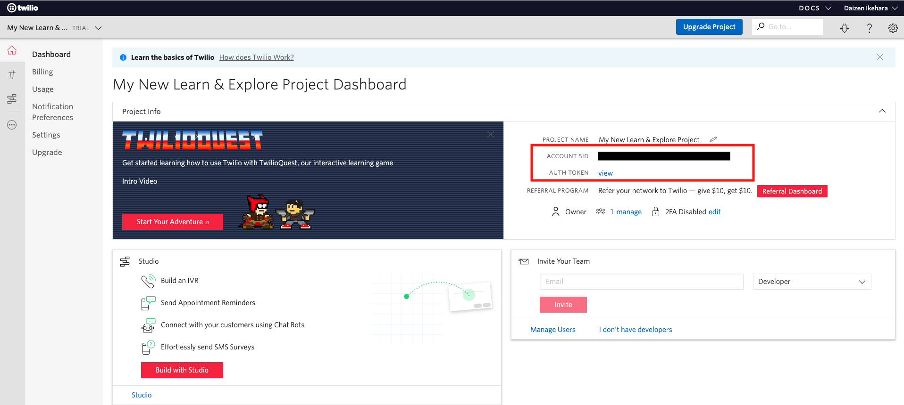

#  手順2: TwilioアカウントをCLIに登録
## はじめに
この手順では、インストールしたTwilio CLIで利用するTwilioアカウントの情報を登録します。既にCLIにアカウントを登録している場合は、[手順3: CLIにオートコンプリート機能を追加（bashまたはzsh）](./01-03-Autocomplete.md)へ進んでください。

## この手順を進めるための前提条件
Twilio CLIがすでにインストールされていること

## 2-1. Twilioアカウント情報を確認

Twilio CLIはTwilioアカウントへの接続情報 (`AccountSid`, `AuthToken`）を利用し、APIキーを作成します。プロファイルを作成した後は、このキーが各種APIの呼び出しに用いられます。

これらの情報はコンソールから確認できます。
[Twilioホームページ](https://www.twilio.com/)をブラウザーで開き、[LOG IN](https://www.twilio.com/login) をクリックするか、[コンソール](https://www.twilio.com/console)に直接移動します。



この画面に表示されている`ACCOUNT SID`と`AUTH TOKEN`を控えます。

## 2-2. アカウント情報をCLIに登録

次のコマンドを実行し、アカウント情報をCLIに登録します。事前に登録が済んでいる場合はスキップいただいて構いません。

```
twilio login
```

最初に`Account Sid`を入力するように求められます。

```
You can find your Account SID and Auth Token at https://www.twilio.com/console
 » Your Auth Token will be used once to create an API Key for future CLI access to your Twilio Account or Subaccount, and then forgotten.
? The Account SID for your Twilio Account or Subaccount: //ここにAccount Sidを入力
```

続けて、`Auth Token`の入力を求められます。画面上には入力文字が表示されません。ご注意ください。

```
? Your Twilio Auth Token for your Twilio Account or Subaccount: [hidden] //ここにAuth Tokenを入力
```

最後にプロファイル名の入力を求められます。Twilio CLIでは複数のアカウント情報を登録し、切り替えることができます。ここでは任意の名前をつけてください。

```
? Shorthand identifier for your profile: //任意のプロファイル名を入力
```
入力された情報をもとにAPIキーが作成され、そのAPIキーの情報とプロファイルの保存場所が表示されます。とくにこの情報は控える必要はありません。

```
Created API Key SKxxxxxxxxxxxxxxxxx and stored the secret in your keychain. See: https://www.twilio.com/console/runtime/api-keys/SKxxxxxxxxxxxxxxx
twilio-cli configuration saved to "/Users/xxxxxxx/.twilio-cli/config.json"
Saved twilio-cli-handson.
```

## 関連リソース

- [Twilio REST API](https://jp.twilio.com/docs/iam/api)
- [REST API: APIキー](https://jp.twilio.com/docs/iam/keys/api-key)
- [Twilio CLI Quickstart](https://www.twilio.com/docs/twilio-cli/quickstart)


## 次の手順
[手順3: CLIにオートコンプリート機能を追加（bashまたはzsh）](./01-03-Autocomplete.md)