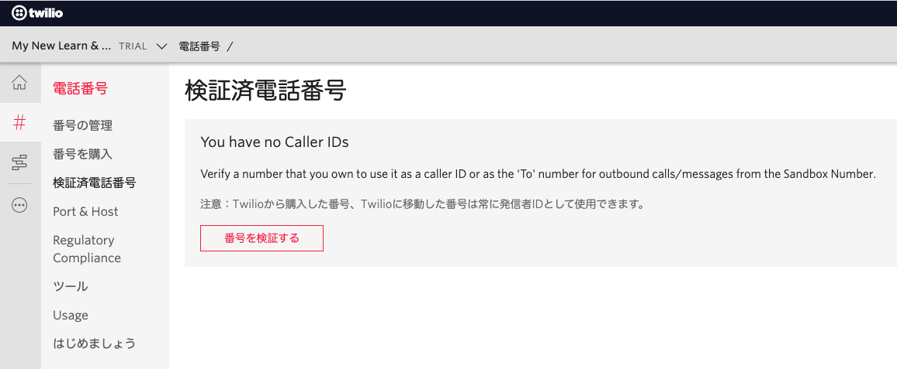

#  手順1: CLIを使った電話番号の取得
## はじめに
この手順では、Twilio CLIを用いてTwilioから電話番号を取得する方法を学びます。  
なお、__トライアルアカウントを利用した場合、いくつかの制限がある__ ことに注意してください。
- トライアルアカウント購入できる電話番号は１番号のみです。
- 電話/SMSの発信は登録された電話番号のみに行えます。

トライアルアカウントの制限についてはこちらをご覧ください。
- [Twilio フリートライアルアカウントに関して](https://support.twilio.com/hc/en-us/articles/360044841214-Twilio-%E3%83%95%E3%83%AA%E3%83%BC%E3%83%88%E3%83%A9%E3%82%A4%E3%82%A2%E3%83%AB%E3%82%A2%E3%82%AB%E3%82%A6%E3%83%B3%E3%83%88%E3%81%AB%E9%96%A2%E3%81%97%E3%81%A6)

## この手順を進めるための前提条件
この手順を進めるためにはTwilio CLIをインストールしており、Twilioアカウントが登録されている必要があります。まだインストールが終わっていない場合は、[ハンズオン: Twilio CLIをインストール](../01-Install-Twilio-CLI/01-00-Overview.md)を先に完了してください。

## 2-1. 購入可能な電話番号を表示

次のコマンドを実行し、SMS、音声通話が可能な米国地域番号番号の一覧を表示します。

```
twilio phone-numbers:buy:local --country-code US --sms-enabled --voice-enabled
```

選択肢から一つ選択し`Enter`キーを押すと購入の意思を確認され、`Y`と入力することで電話番号をAPI経由で購入します。

```
? Phone Number  Region  ISO Country  Address Requirements
  (Use arrow keys)
> +13xxxxxxxxx  AL      US           none
  +12xxxxxxxxx  AL      US           none
  +12xxxxxxxxx  AL      US           none
  +12xxxxxxxxx  AL      US           none
  +12xxxxxxxxx  AL      US           none
  +12xxxxxxxxx  AL      US           none
  +13xxxxxxxxx  AL      US           none
  +12xxxxxxxxx  AL      US           none
  +12xxxxxxxxx  AL      US           none
  +12xxxxxxxxx  AL      US           none
(Move up and down to reveal more choices)
? Are you sure you want to purchase the phone number "+13xxxxxxxxx"? (Y/n)
```
リクエストが正常に処理されると、購入した番号の情報が表示されます。

```
Phone number successfully purchased!
SID                                 Phone Number  Friendly Name
PNxxxxxxxxxxxxxxxxxxxxxxxxxxxxxxxx  +13xxxxxxxxx  (3xx) xxx-xxxx
```

Twilioプロジェクトに`検証済み電話番号`が設定されていない場合は、電話番号の確認を促すエラーが表示されます。
```
» Error code 21404 from Twilio: Trial accounts must verify a phone number before purchasing a Twilio number.. See https
://www.twilio.com/docs/errors/21404 for more info.
```

この場合は、[コンソール](https://jp.twilio.com/console/phone-numbers/verified)から`番号を検証する`ボタンをクリックし、ご自身が所有する電話番号を登録してください。




トライアル版の場合、一度番号を購入したあと、別の番号を購入しようとすると下記のようなエラーメッセージが表示されます。

```
» Error code 21404 from Twilio: Trial accounts are allowed only one Twilio number. To purchase additional numbers, plea
se upgrade your account.. See https://www.twilio.com/docs/errors/21404 for more info.
```

電話番号を購入することができたでしょうか？続けて音声発信とSMSの送信を試してみましょう。

---
**参考: 日本の番号について**

日本の番号を購入する際のコマンドは下記の通りです。

```
$ twilio phone-numbers:buy:local --country-code JP --address-sid ADxxxxxxxxxxxxxxxxxxxx --bundle-sid BUxxxxxxxxxxxxxxxxxxx
```

現在、日本の番号を購入する場合は住所ならびに[本人情報を本人書類を添えて登録](https://support.twilio.com/hc/en-us/articles/360044400214)し、本人確認を行う必要があります。このプロセスで発行された `Address Sid`と`Bundle Sid`を用いて番号を取得します。必要な情報が足りていない場合は次のようなエラーが表示されます。

__Address Sid__ を指定していない場合
```
 » Error code 21631 from Twilio: Phone Number Requires an Address but the 'AddressSid' parameter was empty.. See https://www.twilio.com/docs/errors/21631 for more info.
```

__Bundle Sid__ を指定していない場合
```
 » Error code 21649 from Twilio: To purchase or transfer this number you must provide a bundle compliant with the rules for the country and number type. More information here: https://www.twilio.com/docs/phone-numbers/regulatory/phone-numbers-regulatory-requirements-customers. See https://www.twilio.com/docs/errors/21649 for more info.
```
---

## 関連リソース

- [Twilio フリートライアルアカウントに関して](https://support.twilio.com/hc/en-us/articles/360044841214-Twilio-%E3%83%95%E3%83%AA%E3%83%BC%E3%83%88%E3%83%A9%E3%82%A4%E3%82%A2%E3%83%AB%E3%82%A2%E3%82%AB%E3%82%A6%E3%83%B3%E3%83%88%E3%81%AB%E9%96%A2%E3%81%97%E3%81%A6)
- [規制情報に関わる書類の提出方法](https://support.twilio.com/hc/en-us/articles/360044400214-%E8%A6%8F%E5%88%B6%E6%83%85%E5%A0%B1%E3%81%AB%E9%96%A2%E3%82%8F%E3%82%8B%E6%9B%B8%E9%A1%9E%E3%81%AE%E6%8F%90%E5%87%BA%E6%96%B9%E6%B3%95)
- [Twilio CLI Quickstart](https://www.twilio.com/docs/twilio-cli/quickstart)


## 次の手順
[手順2: CLIを使った電話の発信と着信設定](./02-02-Voice.md)