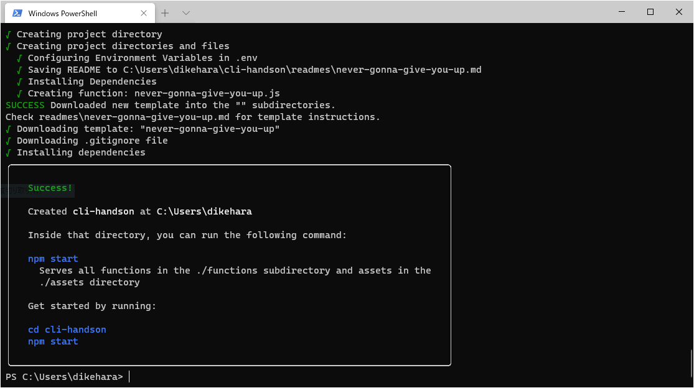
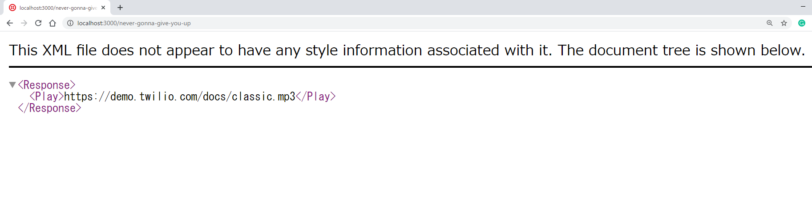

#  手順2: プロジェクトの作成
## はじめに
この手順では、インストールしたServerless Toolkitを使ってTwilio Runtimeにデプロイ可能なプロジェクトを作成する方法を体験します。

Twilio Runtimeを利用することで、開発者が自分自身でWebアプリケーションをホスティングする必要がなくなります。

## この手順を進めるための前提条件
- Twilio CLIとServerless Toolkitがインストールされていること

## 2-1. プロジェクトの初期化

ターミナル、またはコマンドプロンプトを開き次のコマンドでプロジェクトを作成します。

```
twilio serverless:init cli-handson --template never-gonna-give-you-up
```

上記コマンドは、`cli-handson`という名前のプロジェクトを`never-gonna-give-you-up`というテンプレートをベースとして作成します。

プロジェクトが作成され、実行する方法が表示されます。



この指示にしたがい、次のコマンドを実行します。

```
cd cli-handson
npm start
```
`http://localhost:3000/never-gonna-give-you-up`をブラウザーで開くと、__TwiML__ が表示されます。



----

ここからはコーディングの経験がある方向けの説明です。
このプロジェクトフォルダーの中にある`/functions/never-gonna-give-you-up.js`を開くと、先ほどのTwiMLを出力するためのコードを確認できます。

```js
exports.handler = function(context, event, callback) {
  const twiml = new Twilio.twiml.VoiceResponse();
  twiml.play('https://demo.twilio.com/docs/classic.mp3');
  callback(null, twiml);
};
```

---

## 2-2. プロジェクトのデバッグ

Webアプリケーションを一旦停止し、次のコマンドで再度起動します。このコマンドはローカルホストでアプリケーションを実行するとともに、`ngrok`というツールで外部からアクセスできるようにしています。セキュリティ上、この類のツールを利用できない場合はこのセクションをスキップいただいて構いません。

```
twilio serverless:start --ngrok=""
```
ログから`Twilio functions available:`ラベルを探し`https://xxxxxxx.ngrok.io/never-gonna-give-you-up`というURLを探します。

次にTwilio番号から発信した際に利用するTwiMLを指定します。下記のコマンドを参考にTwilio番号、自分の電話番号、URLそれぞれを変更し設定します。
```
twilio api:core:calls:create --from +12xxxxxxxx --to +81xxxxxxxxxx --url https://xxxxxxx.ngrok.io/never-gonna-give-you-up
```

自分の番号に着信があり、音楽は再生されたでしょうか。このようにTwilio Serverless Toolkitを利用しTwiMLを返すWebアプリケーションを簡単に作成できます。

次の手順ではこのローカルアプリケーションを __Twilio Runtime__ にデプロイします。


- 関連リソース
  - [Create a Project](https://jp.twilio.com/docs/labs/serverless-toolkit/general-usage#create-a-project)
  - [Serverless Toolkit](https://www.twilio.com/docs/labs/serverless-toolkit)
  - [Twilio CLI Quickstart](https://www.twilio.com/docs/twilio-cli/quickstart)


## 次の手順
[手順3: プロジェクトのデプロイとTwilio番号の着信設定](03-Deploy.md)