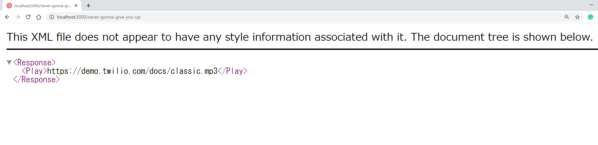

#  手順2: プロジェクトの作成
## はじめに
この手順では、インストールしたServerless Toolkitを使ってTwilio Runtimeにデプロイ可能なプロジェクトを作成する方法を体験します。

Twilio Runtimeを利用することで、開発者が自分自身でWebアプリケーションをホスティングする必要がなくなります。

## この手順を進めるための前提条件
- Twilio CLIとServerless Toolkitがインストールされていること

## 2-1. プロジェクトの初期化

次のコマンドでプロジェクトを作成します。

```
twilio serverless:init cli-handson --template never-gonna-give-you-up
```

上記コマンドは、`cli-handson`という名前のプロジェクトを`never-gonna-give-you-up`というテンプレートをベースとして作成します。

プロジェクトが作成され、実行する方法が表示されます。


この指示にしたがい、次のコマンドを実行してみましょう。

```
cd cli-handson
npm start
```
`http://localhost:3000/never-gonna-give-you-up`をブラウザーで開くと、__TwiML__ が表示されていることを確認できます。



このプロジェクトフォルダーの中にある`/functions/never-gonna-give-you-up.js`を開くと、先ほどのTwiMLを出力するためのコードを確認できます。

```js
exports.handler = function(context, event, callback) {
  const twiml = new Twilio.twiml.VoiceResponse();
  twiml.play('https://demo.twilio.com/docs/classic.mp3');
  callback(null, twiml);
};
```

## 2-2. プロジェクトのデバッグ

Webアプリケーションを一旦停止し、次のコマンドで再度起動します。ローカルホストでアプリケーションを実行し、`ngrok`というツールをさらに起動することで外部からアクセスできるようになります。セキュリティ上、この類のツールを利用できない場合はこのセクションをスキップいただいて構いません。

```
twilio serverless:start --ngrok=""
```
出力から`Twilio functions available:`というラベルを探し、`https://xxxxxxx.ngrok.io/never-gonna-give-you-up` (xxxxxxxは環境によって異なる)というURLを控えてください。

次に[ハンズオン: Twilio CLIを使ったサービスの利用 手順2: CLIを使った電話の着信設定と発信](../02-Use-Twilio-CLI/02-02-Voice.md#2-3-検証済み番号にtwilio番号から発信)のようにTwilio番号からご自身の番号に発信した際に利用するTwiMLを指定します。
次のコマンドをご自身のTwilio番号、電話番号、URLそれぞれを変更し設定してください。
```
twilio api:core:calls:create --from +12xxxxxxxx --to +81xxxxxxxxxx --url https://xxxxxxx.ngrok.io/never-gonna-give-you-up
```

いかがでしょうか。音楽は再生されましたか？ Twilio Serverless Toolkitを利用することでTwiMLを返すWebアプリケーションを簡単に作成できます。

次の手順ではこのローカルアプリケーションを __Twilio Runtime__ にデプロイします。


## 関連リソース

- [Create a Project](https://www.twilio.com/docs/labs/serverless-toolkit/general-usage#create-a-project)
- [Serverless Toolkit](https://www.twilio.com/docs/labs/serverless-toolkit)
- [Twilio CLI Quickstart](https://www.twilio.com/docs/twilio-cli/quickstart)


## 次の手順
[手順3: プロジェクトのデプロイとTwilio番号の着信設定](./03-03-Deploy.md)